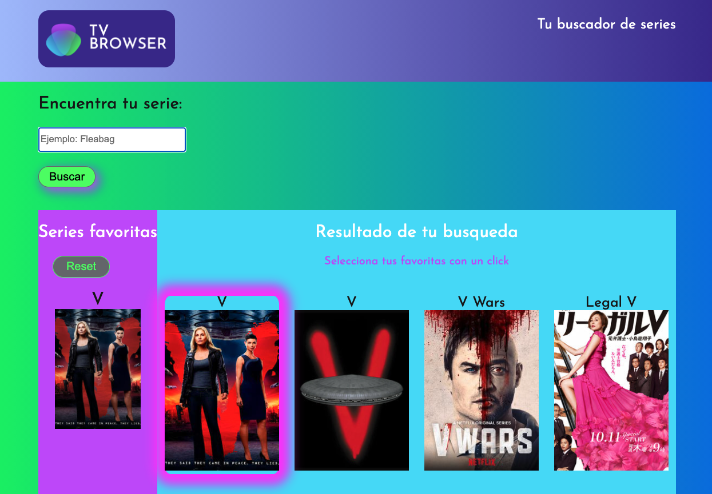

# modulo-2-evaluacion-final-moniLamas
## Desarrollar una aplicación web de búsqueda de series de TV, que nos permite marcar y desmarcar las series como favoritas y guardarlas en local storage.

### SOBRE EL PROYECTO
He diseñado y desarrollado __Tv browser. Tu buscador de series__



## Siguiendo los siguientes requerimientos
#### 1. Estructura básica
En primer lugar hay que realizar una estructura básica sobre este modelo. No hay que preocuparse por las medidas, colores ni tipografía hasta un hito posterior.
La aplicación de búsqueda de series consta de dos partes:
  1. Un campo de texto y un botón para buscar series por su título.
  2. Un listado de resultados de búsqueda donde aparece el cartel de la serie y el título.
  
#### 2. Búsqueda
  - Al hacer clic sobre el botón de Buscar, la aplicación debe conectarse al API abierto de TVMaze para búsqueda de series. Os recomendamos echar un vistazo al JSON que devuelve una petición de búsqueda para ver qué datos son los que necesitamos: https://api.tvmaze.com/search/shows?q=girls
  - Para construir la URL de búsqueda hay que recoger el texto que ha introducido la usuaria en el campo de búsqueda.
  - Por cada show contenido en el resultado de la búsqueda hay que pintar una tarjeta donde mostramos una imagen de la serie y el título.
  - Mostrar siempre una imagen de la serie aunque el objeto no contenga una url
  - Para pintar la información en la página se puede elegir entre hacerlo de forma básica con innerHTML o manipulando de forma avanzada el DOM.
  
#### 3. Favoritos
Una vez aparecen los resultados de búsqueda, la usuaria puede indicar cuáles son nuestras series favoritas. Para ello, al hacer clic sobre una serie debe pasar lo siguiente:
  - El color de fondo y el de fuente se intercambian, indicando que es una serie favorita.
  - Hay que mostrar un listado en la parte izquierda de la pantalla, debajo del formulario de búsqueda, con las series favoritas. Os recomendamos crear un variable o constante de tipo array en JS para almacenar las series favoritas.
  - Las series favoritas deben seguir apareciendo a la izquierda aunque la usuaria realice otra búsqueda.
  
#### 4. Almacenamiento local
Hay que almacenar el listado de favoritos en el localStorage. De esta forma, al recargar la página el listado de favoritos se debe mostrarse.

#### 5. BONUS: Borrar favoritos
Como bonus, os proponemos la opción de borrar favoritos. Al hacer clic sobre el icono de una 'x' al lado de cada favorito, hay que borrar el favorito clicado de la lista y del localStorage.
Para terminar de rematar nuestra app de series, nos gustaría poder añadir/quitar como favorito al hacer clic sobre una serie del lado de la derecha. Y que, si realizamos una nueva búsqueda y sale una serie que ya es favorita, aparezca ya resaltada en los resultados de búsqueda (con colores de fondo y texto intercambiados).
Y ya sería fantástico si al final de la lista de favoritos hay un botón para borrarlos todos los favoritos a la vez.

#### 6. BONUS: Afinar la maquetación
Una vez terminada la parte de interacción, podemos centrarnos en la parte de maquetación donde tenéis libertad para decidir los estilo. En cualquier caso os dejamos una propuesta gráfica.


### Construido con

<p align="left"> <a href="https://www.gnu.org/software/bash/" target="_blank">  </a> <a href="https://www.w3schools.com/css/" target="_blank">  </a> <a href="https://git-scm.com/" target="_blank">  </a> <a href="https://gulpjs.com" target="_blank">  </a> <a href="https://www.w3.org/html/" target="_blank">  </a> <a href="https://developer.mozilla.org/en-US/docs/Web/JavaScript" target="_blank">  </a> <a href="https://sass-lang.com" target="_blank">  </a> </p>


## Comenzando

### Prerrequisitos

Este es un ejemplo de cómo listar las cosas que necesitas para usar el software y cómo instalarlas.
### npm
Instalar npm en su terminal, siguiendo las instrucciones detalladas en la página oficial de [Node](https://nodejs.org/es/download/)

### Instalación

1. Clona el repo
   ```sh
   git clone https://github.com/Adalab/modulo-2-evaluacion-final-moniLamas.git
   ```
2. Instalar los paquetes NPM
   ```sh
   npm install
   ```
3. Ejecutar el comando para visualizar en su navegador 
   ```sh
   npm start
   ```   

## Contribuir

Las contribuciones son lo que hace que la comunidad de código abierto sea un lugar increíble para aprender, inspirar y crear. Cualquier contribución que hagas es **muy apreciada**.

1. Fork del proyecto
2. Crea tu rama de características (`git checkout -b feature/AmazingFeature`)
3. Confirme sus cambios (`git commit -m 'Add some AmazingFeature'`)
4. Empuja a la rama (`git push origin feature/AmazingFeature`)
5. Abrir un Pull Request


## Licencia

Distribuido bajo la licencia MIT. Ver `LICENSE` para más información.


## Contacto

Estoy disponible en Twitter - [Moni Lamas](https://twitter.com/MoniMonipeny) 

